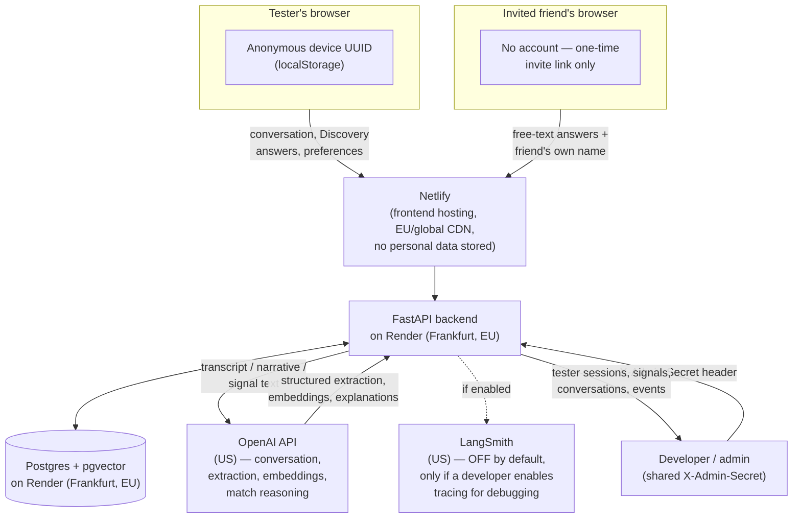

# Anaphora — GDPR Documentation

*Last updated 2026-09-03. Written against the actual current implementation
(`anaphora_backend/app/models.py`, routers, and chains) rather than a
generic template — every claim below traces to real code or the in-app
Privacy Policy (`frontend/src/screens/Legal.jsx`), which testers actually
see. Not legal advice; have this reviewed by counsel before any public
launch. This document is the formal counterpart to `Legal.jsx`'s
plain-language notice — the two should stay consistent as the product
evolves.*

## 0. Status and scope

Anaphora is currently a **private MVP in active testing** with a small,
invited tester group (~20+ testers at time of writing) — not a public,
commercial service. That status matters for this document: several
GDPR obligations that would be non-negotiable for a public launch (a
registered DPO contact, a finalized retention schedule, a self-service
deletion flow) are explicitly tracked below as **pre-launch gaps** rather
than assumed to be solved.

- **Controller**: currently the individual developer/founder operating
  Anaphora as a capstone project. Formalizing this (a registered legal
  entity, a named controller, a DPO or privacy contact point) is a
  pre-launch action, not yet done — see §8.
- **Data subjects**: (a) private testers, identified pseudonymously (no
  account, no login — see §2); (b) friends invited via a one-time link to
  answer a short questionnaire about a tester, who never create an
  Anaphora account themselves.
- **Not a data subject**: `Candidate` rows (the ~50-profile synthetic
  matching pool) are LLM-generated fictional personas, not real people.
  They are explicitly out of scope for this document — see §2.

---

## 1. Categories of personal data processed

| Table | Fields | What it is | Notes |
|---|---|---|---|
| `users` | `id` | Pseudonymous identifier — a UUID the frontend generates and stores in `localStorage` on first load, sent as `X-Anaphora-User-Id` on every request | No login, no email/password. See `anaphora_backend/app/auth.py`. |
| `users` | `gender`, `gender_preference`, `birth_date`/`age`, `preferred_age_range`, `location`, `language` | Basic matching-preference and profile fields | `gender`/`gender_preference` combined with attraction data is treated as special category — see §3 |
| `users` | `name`, `email` | Columns exist in the schema | **Not currently populated by any implemented flow** — no screen collects them today. Flagged here so the register stays accurate if/when a future flow starts using them. |
| `users` | `blueprint_narrative` | AI-written first-person portrait of the partner the tester described | Free text, LLM-generated from the tester's own words |
| `conversations` | `messages` | The full onboarding conversation transcript (both sides) | Free text; the richest, most sensitive data category in the product |
| `blueprint_evidence` | `perspective`, `category`, `label`, `evidence_text`, `strength`, `source`, `confidence`, `supersedes_evidence_ids` | Raw, append-only observation rows from every source — conversation, Discovery, an accepted friend contribution, or a member's own correction | Never edited or deleted in place; a correction is stored as new evidence that *supersedes* specific prior rows rather than overwriting them, so original wording persists in this table after the member-facing Blueprint no longer reflects it — see the Rectification note in §6. Inferred/derived personal data — see §3 for special-category analysis |
| `blueprint_signals` | `perspective` (ME / IDEAL_PARTNER / US), `category`, `label`, `evidence_text`, `strength`, `confidence`, `evidence_ids` | The clean, member-facing Blueprint — an LLM-canonicalized projection rebuilt from the member's full `blueprint_evidence` history on every mutation, not edited signal-by-signal | Inferred/derived personal data — see §3 for special-category analysis |
| `discovery_responses` | `response` | Free-text or choice answers to short lifestyle questionnaires (e.g. "What kind of life are you building?") | Same sensitivity profile as conversation data, smaller volume |
| `friend_invites` | `status`, `created_at` | Metadata about a single-use invite link | Minimal — no personal data beyond the inviting tester's `user_id` |
| `friend_responses` | `friend_name`, `raw_answers`, `narrative` | The invited friend's own name and their free-text answers describing the inviting tester | **Two data subjects in one record**: the friend (who wrote it) and the tester (who it's about). `raw_answers` is never exposed to the tester — only the paraphrased `narrative` and derived signals, and only after the tester explicitly accepts each one (see `friends_router.py`). |
| `friend_signals` | `perspective`, `category`, `label`, `evidence_text` | Candidate Blueprint signals extracted from a friend's answers | Stays separate from `blueprint_signals` until the tester explicitly accepts it |
| `tester_events` | `event`, `metadata_json` | Pseudonymous product-usage telemetry: `app_opened`, `conversation_started`, `message_sent` (+turn count), `blueprint_created` (+readiness %), `discovery_completed`, `preferences_saved`, `intros_opened`, `match_returned`, `api_error` | First-party only, no free text, no third-party analytics vendor (verified — no Google Analytics/Mixpanel/Segment/etc. in the codebase). See `frontend/src/api.js`'s `trackEvent`. |
| `candidates` | — | Synthetic, LLM-generated fictional profiles (name, narrative, structured signals, embedding) | **Not personal data** — no real natural person. Out of scope for this document. |

---

## 2. Special category data (Article 9)

This is the single most important compliance consideration for Anaphora, and it deserves to be named explicitly rather than left implicit:

**Anaphora's core product function — inferring who a person is attracted to and what kind of relationship they want — plausibly constitutes data "concerning a natural person's sex life or sexual orientation" under Article 9(1).** This isn't an edge case; it's what the product does for every tester who completes onboarding. `gender_preference`, `physical_type` signals, and much of the `relationship_shape`/`connection_affection` Blueprint data fall into this category.

In addition, because onboarding is an open conversation rather than a fixed form, testers can **incidentally** volunteer other Article 9 categories in free text — religious belief ("faith and personal growth are essential" appeared in real seeded candidate data as an example of the kind of language this product handles) or health-adjacent language (attachment-style/emotional-pattern discussion). This is a structural risk of any conversational product and can't be fully engineered away, only minimized and disclosed.

**Current legal basis in practice**: the in-app Privacy Policy (`Legal.jsx`) states: *"By having the conversation, you're explicitly consenting to Anaphora processing that information for the one purpose of building your Blueprint and finding matches."* This is a reasonable plain-language framing for testers, but as a formal Article 9(2)(a) **explicit consent** mechanism it's legally thinner than it should be — consent inferred from starting a conversation is not the same as an unambiguous, distinct affirmative action. **Recommendation (see §8): add a separate, explicit consent checkpoint** (e.g. a checkbox naming the special-category inference specifically) before the first conversation begins, distinct from general Terms acceptance.

---

## 3. Data flow map

Two flows worth calling out explicitly:

- **Friend → tester flow**: a friend's raw answers go to OpenAI for extraction (same as tester data), are stored in `friend_signals`/`friend_responses`, and are shown to the *tester* only as a paraphrased narrative plus individually-acceptable structured signals — the friend's own verbatim words are never returned by any authenticated endpoint (`friends_router.py`). The friend never becomes an Anaphora user or gets their own account/ID.
- **Admin flow**: a single shared secret (`ADMIN_SECRET`, a Render environment variable) gates `GET/DELETE /admin/test-sessions` and `GET /admin/test-sessions/{user_id}`, which return full conversation transcripts, Blueprint signals, and Discovery answers for research purposes during the testing phase. There is currently no per-admin identity or access log — see §8.

---

## 4. Processing activities register

| Activity | Purpose | Data categories | Legal basis | Retention (current) | Recipients / processors |
|---|---|---|---|---|---|
| Onboarding conversation + Blueprint extraction | Core product function — build the tester's Relationship Blueprint | Conversation transcript, structured ME/IDEAL_PARTNER/US signals (incl. likely special category, §3), narrative portrait | Consent (Art. 6(1)(a)); special-category processing relies on the conduct-based consent described in §3 — **flagged as needing strengthening** | Indefinite — no automatic deletion schedule (self-disclosed gap, see §8) | OpenAI (processor, US); Render (hosting, EU) |
| Discoveries (lifestyle questionnaires) | Enrich the Blueprint with structured, lower-effort signals | Discovery answers, derived signals | Consent | Same as above | OpenAI, Render |
| Matching preferences + RAG matching | Generate and explain candidate introductions | `gender`, `gender_preference`, `age`/`preferred_age_range`, Blueprint signals sent as embedding/reasoning input | Consent | Same as above | OpenAI (embeddings + reasoning), Render |
| Ask Friends | Gather a third-party perspective on the tester | Friend's name + free-text answers (about the tester); tester-accepted derived signals | Consent — the tester's, for requesting it; the friend's, given via the in-product notice + "I agree — continue" action before answering (`FriendLanding.jsx`) | Same as above | OpenAI, Render |
| Tester analytics (product research) | Understand usage during the private test round via the internal admin dashboard | Pseudonymous event names + small numeric/id metadata (no free text) | Legitimate interest (Art. 6(1)(f)) — testers are aware they are part of a monitored test round | Until testing concludes; bulk-clearable via the admin panel's "Clear test data" action | Internal only — no external recipient |
| Optional LLM tracing (LangSmith) | Debugging/observability during development | Full prompt/response content, i.e. a superset of every category above | Legitimate interest | Only exists while a developer has explicitly enabled `LANGCHAIN_TRACING_V2` — **off by default in production use** | LangSmith / LangChain Inc. (processor, US), only if enabled |

---

## 5. Short DPIA — onboarding conversation, Blueprint extraction, and matching

**Why this is the highest-risk activity**: it's the only activity that (a) involves likely Article 9 special-category data, (b) sends that data to a third-party sub-processor (OpenAI) for processing, (c) has no defined retention limit, and (d) has no individual self-service deletion path today.

**Necessity and proportionality**: the processing is core to the product — Anaphora cannot function as a matchmaking service without understanding who a tester is and who they're looking for. The concern is not whether this processing should happen, but how long it's kept and how clearly consent is obtained for its most sensitive components.

**Risks identified**:
1. Special-category data relies on conduct-based rather than an explicit, distinct consent action (§3).
2. No defined retention period or automatic deletion — data persists indefinitely absent a manual admin bulk-clear (self-disclosed in `Legal.jsx`).
3. No individual self-service export or deletion — only a full bulk wipe of *all* testers (`DELETE /admin/test-sessions`) or a manual, email-requested deletion by a developer.
4. Third-party processing (OpenAI, and optionally LangSmith) of raw personal narratives — data processing terms with OpenAI should be formally confirmed and referenced (OpenAI publishes a DPA covering API usage), not just assumed.
5. Admin access to full tester data is gated by one shared secret with no per-admin identity or audit trail.
6. Free-text conversation can incidentally capture special-category data beyond what the product intends to elicit (§3), which is difficult to fully prevent by design.

**Mitigations (recommended, prioritized in §8)**:
- Add a distinct, explicit consent checkpoint before the first conversation, naming the special-category inference specifically.
- Define and implement a retention period with automatic deletion or anonymization after inactivity.
- Add a self-service "export my data" and "delete my data" endpoint, keyed to the tester's own device UUID.
- Formally document OpenAI's DPA/SCC coverage for API usage (and LangSmith's, if tracing is ever enabled in production).
- Add basic access logging to the admin endpoints.

**Residual risk after mitigation**: medium. Even with all mitigations in place, this remains a product that processes special-category dating-preference data by design — that risk is inherent to the use case and can be managed but not eliminated.

---

## 6. Data subject rights support

| Right | Status today | Mechanism |
|---|---|---|
| Access | **Supported** | The Blueprint screen shows every signal Anaphora has inferred about the tester, in-app, at any time |
| Rectification | **Supported for the member-facing Blueprint; the underlying raw evidence is superseded, not erased** | `PATCH /blueprint/signal/{id}` lets a tester correct any individual signal's label/strength directly from the Blueprint screen. This writes a new, authoritative `blueprint_evidence` row (`source="user_correction:..."`) that the next canonicalization rebuild treats as controlling, so the corrected wording is what the tester sees and what matching uses going forward. It does **not** delete or rewrite the original evidence row the correction supersedes — that stays in `blueprint_evidence` by design, so the tester's evidence history remains auditable. A rectification request that specifically asks for the original (pre-correction) wording to be erased, not just superseded, currently needs the manual erasure path below — **gap worth tracking, see §8.** |
| Erasure | **Manual only** | No self-service per-tester deletion exists. `DELETE /admin/test-sessions` deletes *all* testers at once (used between test rounds), and there's no per-user-id admin delete. Individual requests are currently handled by email to a placeholder address and fulfilled manually by a developer. **Gap — see §8.** |
| Portability / data export | **Manual only** | No export endpoint exists. Same manual, email-based process as erasure. **Gap — see §8.** |
| Restriction of processing | **Not implemented** | No mechanism to pause processing while keeping data. **Gap.** |
| Object / withdraw consent | **Not implemented as a distinct flow** | Practically achievable via account deletion, but there's no separate "stop processing, keep my account" option. **Gap.** |

**A practical limitation worth noting**: because there is no login or email, a tester's only way to prove which data is theirs — for any of the above — is to know or provide their own device UUID from `localStorage`. If they clear their browser data first, they lose the practical means to exercise these rights, even though the data itself is still identifiable to Anaphora internally. This is disclosed in-app but is a real constraint of the current pseudonymous-only identity model, worth resolving before a wider launch.

---

## 7. Third-party processors and cross-border transfers

| Processor | Role | Data received | Location | Transfer basis |
|---|---|---|---|---|
| **OpenAI** | Conversation completion, structured extraction, Discovery insight synthesis, embeddings, match reasoning | Conversation transcripts, Blueprint narrative/signals, Discovery answers, friend answers — effectively all free-text personal data in the product | US | Third-country transfer. OpenAI publishes a DPA covering API usage (incorporating SCCs); **formally confirming and referencing that agreement is an open action item**, not yet documented beyond the in-app disclosure. |
| **LangSmith / LangChain Inc.** | Optional LLM call tracing for debugging | Full prompt/response content (superset of the above), only if enabled | US | Same as above. **Lower priority**: disabled by default (`LANGCHAIN_TRACING_V2=false`), only active when a developer explicitly turns it on during development. |
| **Render** | Backend hosting + Postgres database | All persisted personal data described in §1 | **Frankfurt, Germany (EU)** — confirmed in the in-app Privacy Policy | No transfer — data stays in the EU |
| **Netlify** | Frontend static hosting / CDN | None persisted — the frontend calls the backend API directly and does not itself store tester data | Global CDN edge (standard web hosting) | Not a personal-data processor in the GDPR sense for this product; no server-side storage on Netlify |

No other third-party analytics, advertising, or tracking services are integrated (verified against the frontend and backend codebases — no Google Analytics, Mixpanel, Segment, Meta Pixel, or similar).

---

## 8. Known gaps and remediation roadmap

These are the same gaps the product's own in-app Privacy Policy already discloses to testers — tracked here with priority and target maturity stage, since a private MVP round is a reasonable point to *know and disclose* these gaps but not yet have closed all of them:

| Gap | Priority | Target stage |
|---|---|---|
| No distinct, explicit consent checkpoint for special-category inference (§3) | High | Before any pilot beyond the current private test round |
| No defined data retention period / automatic deletion | High | Before pilot |
| No self-service export/delete for individual testers | High | Before pilot |
| Superseded `blueprint_evidence` rows (pre-correction wording) have no self-service erasure path distinct from full account deletion (§6) | Medium | Before pilot |
| OpenAI (and LangSmith, if used) DPA/SCC coverage not formally documented beyond in-app disclosure | Medium | Before pilot |
| Admin access via one shared secret, no per-admin audit log | Medium | Before pilot |
| CORS currently allows any origin (`allow_origins=["*"]` in `main.py`) | Medium | Before pilot |
| No registered controller entity / DPO or privacy contact point | Medium | Before public launch |
| No formal Data Processing Agreement templates for future B2B/partner use | Low | Full deployment |

This table is intended to feed directly into `strategic_plan.md`'s phase gates — several of these are natural "must-fix-before-pilot" criteria rather than open-ended future work.
