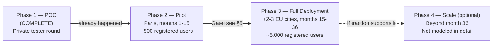
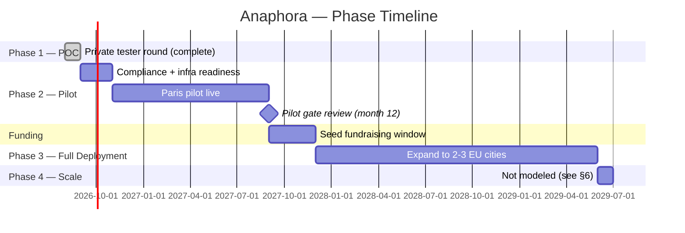

# Anaphora — Strategic Deployment and Commercialisation Plan

*Last updated 2026-09-03. Builds directly on `use_case_definition.md`
(stakeholders, success criteria), `roi_risk_assessment.md` (pricing,
growth trajectory, funding, break-even finding), `gdpr_documentation.md`
and `eu_ai_act_compliance.md` (compliance gates), and real data from this
project's own private tester round (via the admin panel built this
round). Two milestones — the Full Deployment expansion markets and the
follow-on seed round target — were explicit founder decisions for this
document, flagged as such below; everything else is derived from
decisions already made in the documents above rather than invented fresh.*

---

## 0. Where Anaphora actually is today

Unlike a plan written from a blank page, this one starts from a real,
measured position: the product isn't hypothetical, it has already run a
private testing round. That data belongs at the top of a strategic plan,
not buried in an appendix — it's the strongest evidence available for
what Phase 2 needs to fix.

**From the private tester round** (21 testers, via the admin dashboard
built this round):
- 21/21 (100%) opened the app
- 7/21 (33%) started the core onboarding conversation
- 4/21 (19% of all openers, **57% of conversation-starters**) completed a
  full Relationship Blueprint and received an introduction

That 57% completion-among-starters figure sits **below** the 70% target
already set in `use_case_definition.md` §5 for the pilot phase — which is
exactly the right way to read early POC-stage data: not as a pass/fail
verdict, but as a concrete signal of where Phase 2 effort should go
first (onboarding-conversation drop-off, not matching quality, which the
completers themselves largely validated — all 4 who completed received a
grounded introduction).

---

## 1. Phases

| Phase | Status | Scope | Funding basis |
|---|---|---|---|
| 1 — POC | **Complete** | Build the core pipeline (conversation → Blueprint → readiness → RAG matching → friend input) and validate it with a small private tester group | Founder/team time — no external funding modeled |
| 2 — Pilot | Next | Single city (Paris), real (non-team) users, freemium subscription live | €500,000 pre-seed (per `roi_risk_assessment.md` §1) |
| 3 — Full Deployment | Planned | Founder-approved: expand to **2-3 additional major EU cities** (e.g. Berlin, Amsterdam, Barcelona) | Founder-approved: **€2-3M seed round, targeted month 15-18** |
| 4 — Scale (optional) | Not modeled | Broader EU/international expansion, additional monetization angles | Not modeled — see §6 |

---

## 2. Phase 2 — Pilot (Paris)

**Timeline**: months 1-15 (targeting the pilot→full-deployment gate
around month 12, with a 3-month buffer for the seed round to close before
Phase 3 spend begins — see §5).

**Pre-launch readiness work** (before real, non-team users arrive —
pulled directly from the two compliance documents' own remediation
tables rather than restated from scratch):
- `gdpr_documentation.md` §8's High-priority items: explicit consent
  checkpoint for special-category inference, defined retention/deletion
  schedule, self-service export/delete
- `eu_ai_act_compliance.md` §1.3/§5: reinforce AI-disclosure on the chat
  screen itself, resolve candidate photo provenance
- Upgrade hosting to the paid tier (already costed at $33/mo in
  `roi_risk_assessment.md` §2) — the free tier's 30-day Postgres
  expiry and cold-starts are not acceptable for real users
- Build the trust & safety basics flagged as still-open in
  `roi_risk_assessment.md` §7 risk #7: identity verification step,
  in-app reporting flow, human review queue

**During the pilot**: grow toward the founder-approved trajectory of
~500 registered Paris users by month 12 (`roi_risk_assessment.md` §3),
primarily via the friend-invite loop and local event partnerships (see
§4's go-to-market channel), while tracking the KPIs in §5.

---

## 3. Phase 3 — Full Deployment

**Timeline**: months 15-36.

**Scope** (founder-approved): expand into **2-3 additional major EU
cities**. Each new city effectively re-runs a scaled-down version of the
Paris cold-start playbook (`roi_risk_assessment.md` §7 risk #1's
mitigation — local seeding, event partnerships) rather than assuming
Paris's density carries over automatically.

**Funding** (founder-approved): a **€2-3M seed round targeted for month
15-18** — timed to close before the €500K pre-seed's ~16.7-month runway
(`roi_risk_assessment.md` §6) actually runs out, not after. This is a
real dependency, not a formality: if the round slips, Phase 3 cannot
start on schedule. This document doesn't model a detailed fallback
scenario for a slipped raise, but the honest options are limited to two —
cut burn to extend the existing runway (delaying Phase 3 rather than
funding it on schedule), or raise a smaller bridge round — and either
should be decided before the runway actually runs out, not after.

**Team growth**: the current 5-8 person team (`use_case_definition.md`
§2) needs to add functions it doesn't have today to operate multiple
cities responsibly — growth/marketing (currently: none), trust & safety
operations (currently: not yet built at all), and a formalized compliance
function (currently: founder-as-DPO by default, flagged as a gap in
`gdpr_documentation.md` §0/§8).

**Target by month 36**: ~5,000 registered users across all active cities
(`roi_risk_assessment.md` §3's approved trajectory), with the explicit
understanding — stated plainly in `roi_risk_assessment.md` §6 — that this
trajectory alone does **not** reach operational break-even (≈23,700
registered users needed) within the 36-month window. Full Deployment is
the phase that closes *some* of that gap, not all of it; §6 below
addresses what happens after month 36.

---

## 4. Go-to-market

| Element | Detail |
|---|---|
| **Buyers** | Adults seeking a serious relationship, initially Paris-based. Specifically the segment `research/sector_research.md` identifies as underserved: dating-app users leaving the swipe mechanic, not leaving the category — the same research notes PURE (a feed-based, no-swipe competitor) grew +95% in the same period Tinder/Bumble/Hinge all declined |
| **Channel** | Primarily the friend-invite loop already built into the product (`use_case_definition.md`'s Ask Friends flow — each user invites 1-3 friends, `research/opportunities_risks.md` opportunity #3), supplemented by local event partnerships in each launch city — the same tactic already identified as the cold-start mitigation in the risk matrix, doing double duty as both a density fix and an acquisition channel |
| **Pricing** | FREE / LIGHT €14.99/mo / PREMIUM €29.99/mo (`roi_risk_assessment.md` §3, filling in the tiers `product_document/Anaphora_Vision_Product_Requirements Document.md` §27 defined by feature but left unpriced) |
| **Differentiator** | Explainable, multi-source reciprocal matching — comparing what the user says, their own behavioral patterns, and a friend's independent perspective, and surfacing where they converge or diverge, instead of a black-box compatibility score. `research/sector_research.md`'s competitive scan found no player combining AI-conversational self-discovery, structured friend input feeding the actual match signal, and explainable multi-source reasoning in one product — this is genuine white space, not a marketing claim |

---

## 5. KPIs per phase, and the Pilot → Full Deployment gate

| Phase | KPI | Target | Source |
|---|---|---|---|
| POC (complete) | Conversation-start rate among app openers | Measured: 33% | This round's tester data (§0) — informal baseline, not a target |
| POC (complete) | Blueprint-completion rate among conversation-starters | Measured: 57% | This round's tester data (§0) — below the Pilot target below, motivating Pilot-phase onboarding work |
| Pilot | Blueprint completion (of conversation-starters) | ≥70% | `use_case_definition.md` §5, criterion 1 |
| Pilot | Meaningful enrichment (Discovery/follow-up after first conversation) | ≥60% | `use_case_definition.md` §5, criterion 2 |
| Pilot | Match explanation rated understandable/grounded | ≥70% | `use_case_definition.md` §5, criterion 3 |
| Pilot | Core actions complete without an unhandled error | ≥95% | `use_case_definition.md` §5, criterion 4 |
| Pilot | Free-to-paid conversion | ≥5% (lower bound of the approved 5-8% range) | `roi_risk_assessment.md` §3 |
| Pilot | Registered users in Paris | ~500 by month 12 | `roi_risk_assessment.md` §3 |

**Pilot → Full Deployment gate** (proposed here — this specific
composite gate is new to this document, synthesized from the criteria
above rather than separately founder-approved, and worth the founder
explicitly signing off on before it's treated as final):

1. All four `use_case_definition.md` §5 pilot success criteria met or
   trending clearly toward being met
2. Free-to-paid conversion at or above 5%, observed, not assumed
3. ~500 registered users reached in Paris (validates the growth
   trajectory the Full Deployment budget in `roi_risk_assessment.md` was
   built on)
4. No unresolved **High**-priority item remaining in
   `gdpr_documentation.md` §8 or `eu_ai_act_compliance.md` §2 — Full
   Deployment means more users and more cities, which raises regulatory
   exposure, not lowers it
5. The €2-3M seed round closed, or a signed term sheet in hand — Phase 3
   literally cannot be funded without it

Missing #1-3 means the *product* isn't ready; missing #4 means the
*company* isn't ready to take on that exposure at scale; missing #5 means
Phase 3 isn't fundable yet regardless of product readiness. All three
kinds of readiness matter, not just the product metrics.

---

## 6. What happens after month 36 (Scale — optional, not modeled)

`roi_risk_assessment.md` §6 states plainly that even successful Full
Deployment (~5,000 users by month 36) doesn't reach operational
break-even (~23,700 users needed at current pricing/conversion/cost
assumptions). This plan doesn't paper over that with an unmodeled Phase 4
growth curve. Instead, three concrete levers — any combination, not
necessarily all — would need to move for a Scale phase to make sense:

- **Faster growth**: broader EU/international expansion beyond the 2-3
  Phase 3 cities, funded by a larger Series A rather than the seed round
  modeled here
- **Better unit economics**: the secondary monetization angles already
  identified in `research/opportunities_risks.md` opportunity #5 — deeper
  Discoveries, local event ticketing, roadmap reflective tools like
  "relationship archaeology" — none of which are quantified in
  `roi_risk_assessment.md`'s ROI math, which modeled subscription revenue
  only. These represent real, unmodeled upside, not a plan to rely on
  unvalidated numbers.
- **Leaner cost structure**: team burn is ~700x the infrastructure cost
  per `roi_risk_assessment.md` §2 — at Scale, that ratio is exactly what
  a hiring/automation strategy should target, not the infra bill

A Scale-phase plan with real numbers should be written once Phase 3 data
exists to ground it in — the same principle this entire document set has
followed: label an assumption clearly, or don't make it.

---

## 7. Commercialisation model

**Primary**: freemium subscription (FREE / LIGHT €14.99 / PREMIUM
€29.99, per §4), matching `research/sector_research.md`'s finding that
paid tiers already account for 60.72% of European dating-app revenue —
this validates a paid-first model over an ad-supported one from the
start, not as a later pivot.

**Secondary, unmodeled upside** (§6): deeper Discoveries, local events,
and reflective tools as ARPU-expansion levers once the core subscription
model is validated in the Pilot phase — deliberately not counted in the
ROI numbers in `roi_risk_assessment.md`, which conservatively modeled
only the three subscription tiers.

**Explicitly not the model**: pay-per-contact / pay-per-match pricing
(the Sitch-style alternative considered and set aside when approving
`roi_risk_assessment.md`'s pricing) — `research/opportunities_risks.md`'s
risk table already flagged that pay-per-contact unit economics don't
reliably cover LLM/embedding + CAC costs, and the subscription model
gives more predictable recurring revenue to plan hiring and city
expansion against.

---

## 8. Stakeholder communication plan

Mapped to the stakeholder table already defined in `use_case_definition.md`
§4, rather than a new list:

| Stakeholder | Cadence | Channel | What they need to hear |
|---|---|---|---|
| Users (testers, then pilot users) | Ongoing, in-app | In-app changelog/notices; `Legal.jsx`'s Privacy Policy kept current as gaps in `gdpr_documentation.md` §8 close | What changed, what's still a known limitation (the product already does this honestly — `Legal.jsx` explicitly names its own gaps rather than overclaiming) |
| Friends contributing input | At time of invite only (no account, no ongoing relationship) | The existing in-product consent notice on `FriendLanding.jsx` | Their answers stay private from the person who invited them — already true, keep it true as the flow scales |
| Product/engineering team | Continuous during active development, phase-boundary reviews at each gate in §5 | Standard team practice (sprint-based); this round's own working pattern (ship a fix, test it, document it) is the template to keep | Current state vs. plan, blockers, what the gate in §5 actually requires next |
| Founder / investors | Monthly during Pilot; weekly in the seed-fundraising window (~month 12-18) | Investor update memo, using the real pilot KPIs from §5 as the raise narrative — not projections alone | Progress against the gate in §5, burn vs. the €30K/month assumption in `roi_risk_assessment.md` §2, and the honest break-even finding (`roi_risk_assessment.md` §6, restated in this document's own §6) rather than a rosier unvalidated story |
| Regulators / privacy stakeholders | No proactive filing obligation at this stage (Limited Risk per `eu_ai_act_compliance.md` §1; no DPO legally mandated yet) | `gdpr_documentation.md` and `eu_ai_act_compliance.md` kept as living, dated documents | Nothing owed proactively today — but both documents should be the first thing produced if ever asked, which is exactly why they're written to reflect the real implementation rather than aspirational policy |
| Potential matches / future marketplace participants | N/A until Pilot (the current matching pool is synthetic, per `use_case_definition.md` §6) | Same in-app channel as users, once real reciprocal matching begins | Same fairness/representation commitments already designed into the reciprocal matching logic (`use_case_definition.md` §3) |

---

## 9. Summary timeline

This timeline is illustrative, not a committed calendar — it exists to
show how the pieces in §1-6 fit together in sequence, with the Pilot
gate (§5) and the seed round (§3) as the two hard dependencies the whole
Phase 3 timeline actually rests on.
